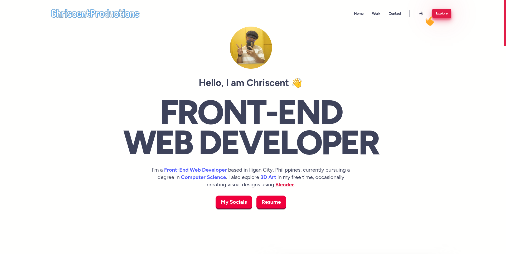

# 🎨 Kishon Shrill's Portfolio

Welcome to my personal portfolio website! 🌐 Here, you can learn more about me, explore my passion 💡, hobbies 🎮🎵, and interests 🌱, and keep up with my current projects and progress 🚧.

## 👨‍💻 About Me

I am Chriscent Pingol, a student from MSU-IIT 🏫 passionate about Web Development 💻. My journey in Computer Science has been fueled by my love for solving puzzles 🧩 and exploring new ways to solve problems from different perspectives 🔍. I’m dedicated to learning more and helping clients build their dream websites 💡🌐.

## 🗂️ Portfolio Overview

### 🔎 Explore My Portfolio

👉 Visit my [Portfolio Website](https://kishonshrill.github.io/website-portfolio/) to check out my latest projects 🚀, read about my experiences 📚, and get to know me better! 😊

### 🔧 Current Project

My latest project is [Budget Buddy](https://productprice-iligan.vercel.app/), a budgeting tool designed to help students/users manage their expenses with ease.

It includes:

<!-- - 💸 Expense tracking (Coming Soon)-->

- 📊 Product listing and their recent updated price

<!-- - 🧠 Smart suggestions based on spending habits (Coming Soon)-->

- 📱 Responsive design for mobile and desktop

Check it out on the Personal Web Projects section of my site for updates and screenshots!

## Inside the Website

- 🙋 **About Me**: Learn more about who I am, my background, and what drives me.
- 📁 **Portfolio**: Explore my latest projects, view project details, and check progress reports.
- 📬 **Contact:** Feel free to reach out via [email](mailto:chriscentlouisjune.pingol@g.msuiit.edu.ph) or [FaceBook](https://www.facebook.com/ChriscentProduction/).

## 🚀 Getting Started

To view my portfolio website and explore my projects, simply click [here](https://chriscent.is-a.dev)!👈. Feel free to leave feedback or get in touch with me!

## Feedback and Contributions

If you have any feedback, suggestions, or if you'd like to collaborate on a project, feel free to open an issue or reach out to me directly.

I appreciate your interest in my work! ✨🙌
