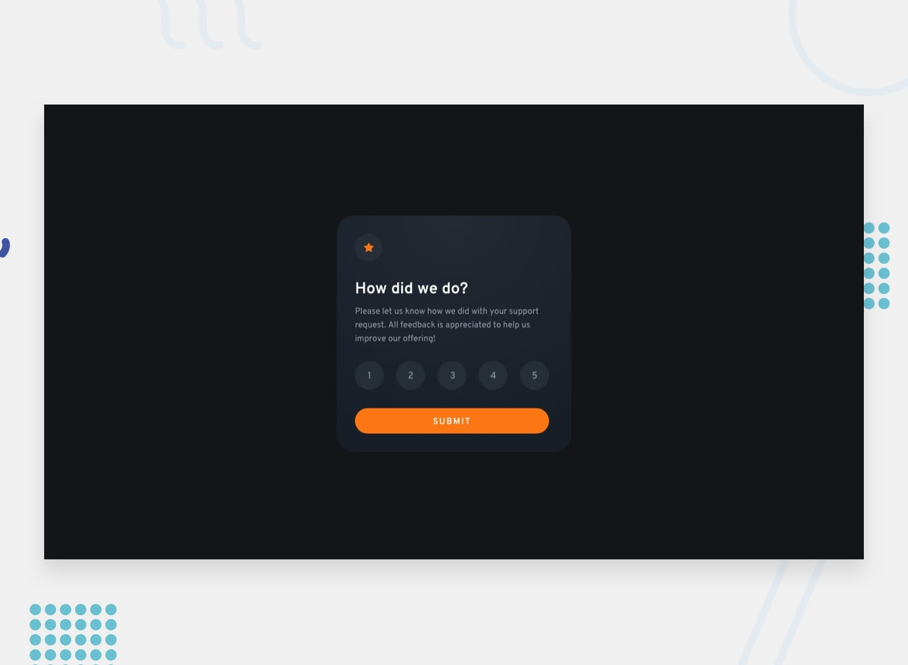

# Frontend Mentor - Interactive rating component

## Table of contents

- [Overview](#overview)
  - [The challenge](#the-challenge)
  - [Links](#links)
- [My process](#my-process)
  - [Built with](#built-with)
  - [Useful resources](#useful-resources)
- [Author](#author)

## Overview

### The challenge

Users should be able to:

- View the optimal layout depending on their device's screen size
- See hover and focus states for interactive elements

### Links

- Solution URL: [Github Path to Solution](https://github.com/KishonShrill/website-portfolio/tree/main/projects/interactive_rating_component/)
- Live Site URL: [Interactive rating component](https://kishonshrill.github.io/website-portfolio/projects/interactive_rating_component/)

## My process

In this solution, I have...
- Utilized the usage of .innerText to update the score fraction from user picked rating

### Built with

- Semantic HTML5 markup
- CSS custom properties
- Flexbox
- Web-first workflow

### Useful resources

- [w3schools](https://www.w3schools.com/) - Helped me remember the syntax and markup to use in html and css.
- [chatGPT](https://chat.openai.com/) - Alternative mentor to ask questions if you are having trouble finding the bugs or solving them.

## Author

- Website - [Chriscent Pingol](https://kishonshrill.github.io/website-portfolio/)
- Frontend Mentor - [@KishonShrill](https://www.frontendmentor.io/profile/KishonShrill)

